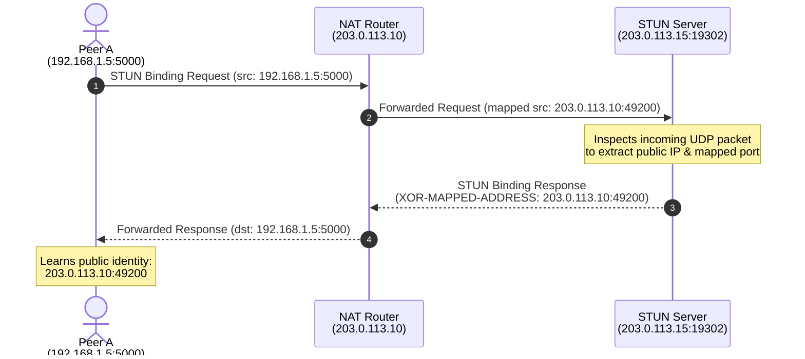
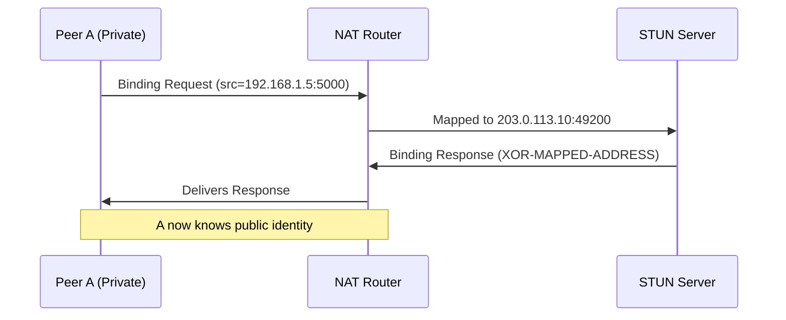
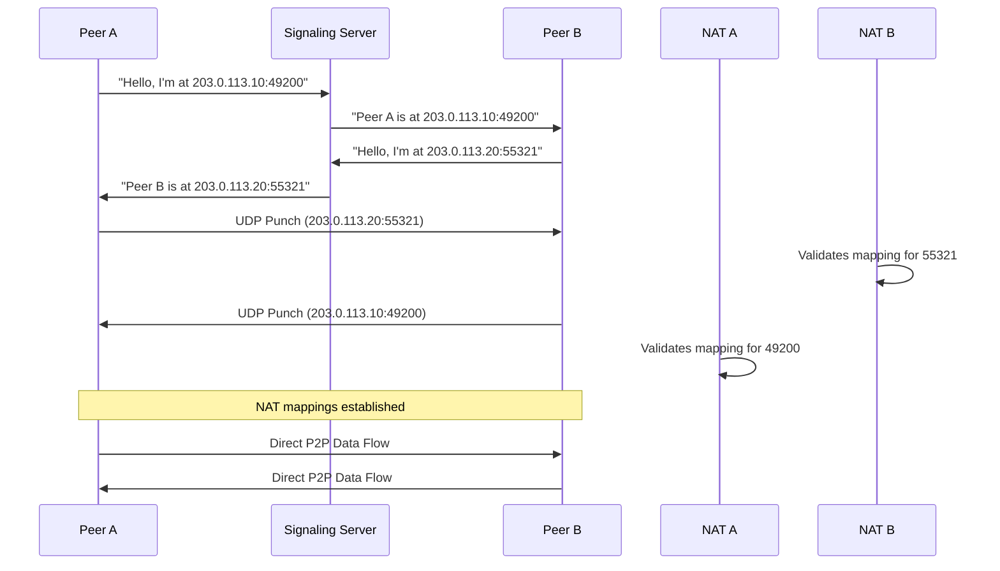

## Introduction: How Do Devices Connect Behind Routers?

Imagine you are trying to call a friend using a video app. Both of you are on different networks: maybe one of you is on a mobile network with a carrier router, and the other is at home behind a personal WiFi router.

Despite this, you can see each other clearly, and video flows without lag. How is this possible when most devices sit behind routers that hide their true identities from the outside world?

The answer lies in how applications discover and punch holes through **NAT (Network Address Translation)** using **STUN servers** and a clever technique called **hole punching**.

From BitTorrent downloads to IPFS (InterPlanetary File System), WebRTC video calls, and even blockchain nodes, every P2P application faces this problem. Let’s explore the mechanics behind it.

---

## The Core Problem: NAT Blocks Direct Connections

### What is NAT?

Your home router usually has a private IP (like `192.168.1.5`) and connects to the internet using a single public IP (like `203.0.113.10`).

When you send a request from `192.168.1.5:5000` to a website, the router:
1. Replaces your private IP with its own public IP.
2. Stores a mapping: `192.168.1.5:5000 → 203.0.113.10:49200`.
3. Returns the response to `49200`, then maps it back to your private address.

This is great for privacy and IP conservation, but it breaks P2P. If a peer on the other side of the internet tries to connect directly to your public IP (`203.0.113.10:49200`), your router won’t know to forward the traffic to `192.168.1.5:5000` — unless your device first “announces” itself.

### Why NAT Types Matter

Not all NATs behave the same. The strictness determines if hole punching will work.

| NAT Type          | How It Handles Outsiders                           | Hole Punching Possible? |
|-------------------|----------------------------------------------------|-------------------------|
| **Full Cone**     | Any external host can send to the mapped IP:port   | ✅ Very Easy             |
| **Restricted**    | Only specific destination IPs can reach you        | ✅ Usually OK            |
| **Port-Restricted**| Only allowed IPs AND ports can reach you          | ✅ With proper pairing   |
| **Symmetric**     | Different external ports for each session         | ❌ Very Hard (Needs TURN) |

Most modern routers use **Port-Restricted** or **Symmetric** NAT, which is why we need STUN and careful coordination.

---

## STUN Server: The Identity Revealer

### What is STUN?

**STUN** stands for **Session Traversal Utilities for NAT**. It is a protocol that helps a client discover:
- Its own public IP address as seen by the internet.
- The public port assigned by the NAT.

### Why Do We Need It?

Inside your network, you know you’re `192.168.1.5:5000`. But the outside world sees `203.0.113.10:49200`.

Without STUN, your app wouldn’t know the public address to share with peers. STUN acts as a mirror: you send a request to it, and it tells you what it “saw” on the other side.

---

## How STUN Works: Step-by-Step

### The Flow

1. **Client sends a STUN Binding Request** to a public STUN server.
2. The server replies with a **Binding Response**, containing:
   - Your detected public IP.
   - The mapped port.
3. The client now knows its external identity and can use it to connect.

### Worked Numerical Example

Let’s walk through a concrete example:

- **Peer A (behind NAT)**:
  - Private: `192.168.1.5:5000`
  - NAT router public IP: `203.0.113.10`
  - STUN server: `stun.l.google.com:19302`

**Request Flow:**



Now Peer A knows exactly where the internet sees it.

---

## NAT Hole Punching: Connecting Two Peers

### The Idea

Once two peers know their public identities (via STUN), they can **simultaneously** send packets to each other’s public IPs and ports.

Because the packets arrive at the NAT at the same time, the NAT creates temporary mappings and allows traffic back — effectively punching a hole.

### Full Example with Two Peers

**Peer A:**
- Private: `192.168.1.5:5000`
- Public (from STUN): `203.0.113.10:49200`

**Peer B:**
- Private: `192.168.2.8:6000`
- Public (from STUN): `203.0.113.20:55321`

**Signaling Server** (rendezvous):
- Coordinates the exchange of public addresses.

**Sequence of Events:**

1. Both peers connect to the signaling server (via UDP/TCP).
2. Signaling server exchanges their STUN-discovered addresses.
3. Peer A sends a UDP packet to Peer B’s public IP:port (`203.0.113.20:55321`).
4. Peer B sends a UDP packet to Peer A’s public IP:port (`203.0.113.10:49200`) at roughly the same time.
5. Each NAT sees incoming traffic for its mapped port → creates/validates the mapping.
6. Subsequent traffic flows directly peer-to-peer.

**Result:** No more server relay needed for data — just a lightweight initial handshake via the signaling server.

---

## When STUN Isn’t Enough

### Symmetric NAT

Some modern routers are **Symmetric NAT**: each new session gets a different external port mapping.

In this case, Peer B might receive:
- Session 1 → `203.0.113.10:49200`
- Session 2 → `203.0.113.10:51000`

Now Peer A’s original address (`49200`) is stale, and hole punching fails.

### TURN: The Fallback

**TURN** (Traversal Using Relays around NAT) solves this by acting as a middleman:
- Peer A sends data to TURN server.
- TURN forwards it to Peer B.
- Works on any NAT type.

### ICE: Bringing It All Together

In WebRTC, **ICE** (Interactive Connectivity Establishment) automatically:
1. Collects multiple candidate addresses (STUN-only, STUN+port, and TURN).
2. Tries each combination.
3. Chooses the fastest direct path (P2P) or falls back to TURN.

This is why your WebRTC call works even on strict NATs.

---

## Hands-On: Using STUN Clients

You can verify your own public IP and port mapping with CLI tools.

### Using stunclient

1. Install:
   ```bash
   npm install -g stunclient
   ```
2. Run:
   ```bash
   stunclient stun.l.google.com:19302
   ```
3. Sample Output:
   ```
   STUN Server: stun.l.google.com:19302
   Mapped Address: 203.0.113.10:49200
   ```

### Using turnutils_stunclient (Linux/Debian)

1. Install:
   ```bash
   sudo apt install turnutils-stunclient
   ```
2. Run:
   ```bash
   stunclient stun.l.google.com:19302
   ```

### Popular Public STUN Servers

| Provider      | Address                         |
|---------------|----------------------------------|
| Google        | `stun.l.google.com:19302`       |
| Twilio        | `stun.twilio.com:3478`          |
| Cloudflare    | `stun.cloudflare.com:3478`      |
| FreeCodeCamp  | `stun.fcc.org:3478`             |

Try them all — they should return the same public IP and port on a stable connection.

---

## Visualizing the Process

### 1. STUN Binding Request/Response Flow



### 2. Hole Punching Between Two Peers



---

## Frequently Asked Questions

**1. Why can’t I just connect directly to my friend’s IP?**  
Because your router hides your real IP and doesn’t know to forward random incoming packets. STUN and hole punching let you announce yourself and coordinate with peers so the router accepts the connection.

**2. Do I need a STUN server for WebRTC?**  
Yes, WebRTC uses STUN by default to discover public addresses. TURN is only needed if STUN fails (e.g., Symmetric NAT).

**3. Can a STUN server see my private IP?**  
No. STUN servers only see the NAT’s public IP. Your private IP never leaves your local network.

**4. Is STUN secure?**  
STUN itself is not encrypted. For WebRTC, it’s typically run over UDP/TLS or inside an already-encrypted connection (like WebSocket) to prevent eavesdropping during discovery.

---

## Conclusion

STUN servers and NAT hole punching are the unsung heroes behind every peer-to-peer connection you rely on — from streaming video calls to decentralized file sharing.

Understanding how they work not only demystifies your internet connections but also helps you build robust, scalable P2P applications that work across all network types.
