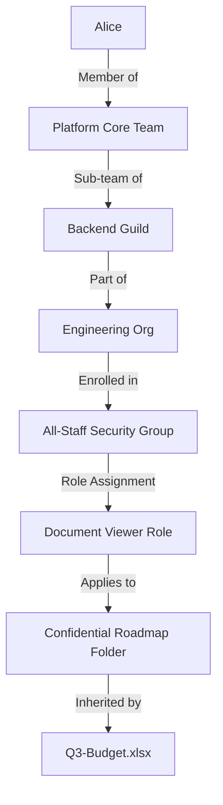
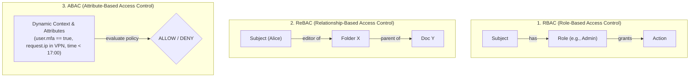
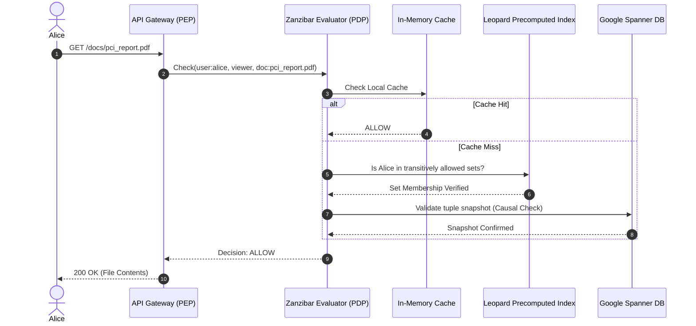
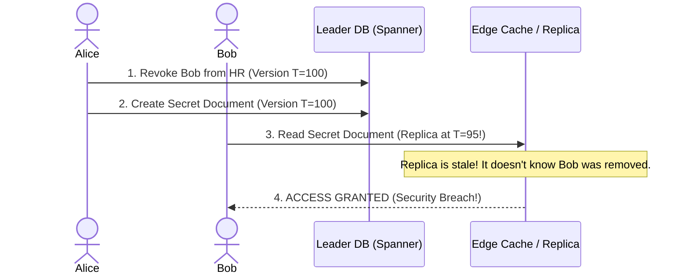
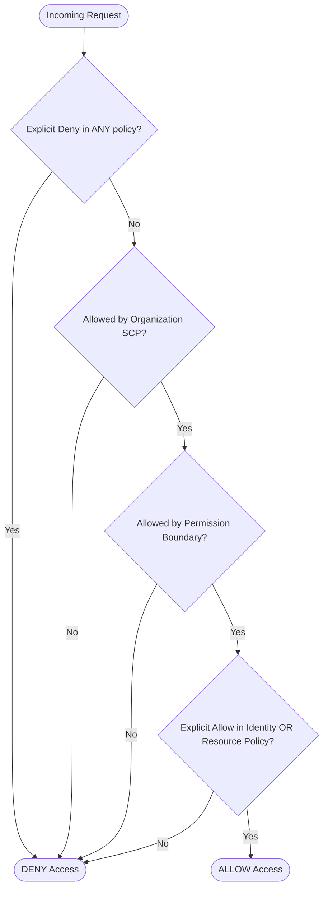
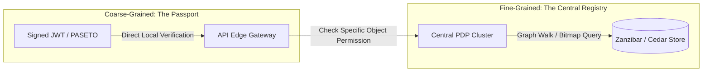

Have you ever wondered what actually happens when you open a private Google Doc, push code to an enterprise GitHub repository, or run an `aws s3 cp` command?

To you, it feels instantaneous. But behind that single click, a distributed system resolved an intricate web of questions:

* Which teams do you belong to?
* Which parent groups contain those teams?
* Does your device meet corporate security compliance?
* Does an explicit deny rule exist at the organizational root?
* Did someone revoke your access five seconds ago in another region?

Platforms like **Google Workspace**, **Microsoft 365**, **GitHub Enterprise**, and **AWS** process **hundreds of millions of authorization checks every second**. They do this over deeply nested organizational hierarchies with a **p99 latency under 5 milliseconds**.

How do they pull this off without melting their databases? Let's pull back the curtain and explore the data structures, algorithms, and architectural patterns that power hyperscale IAM.

---

## The Monolithic Trap: Why Traditional Databases Choke

When building a system from scratch, the instinctive approach to permissions is to write a SQL query against relational tables:

```sql
SELECT 1 
FROM user_groups ug
JOIN role_permissions rp ON ug.role_id = rp.role_id
WHERE ug.user_id = 'alice' 
  AND rp.permission = 'document.write';

```

This works fine for a startup with a few hundred users. But consider what happens in an enterprise like GitHub or Microsoft 365:



To determine if Alice can view `Q3-Budget.xlsx`:

1. The database must traverse an arbitrary **Directed Acyclic Graph (DAG)** of nested teams and inherited folders.
2. An organization might have 15 levels of nested groups and 200,000 employees.
3. Live recursive table joins (`WITH RECURSIVE`) lock rows, swamp database CPU cores, and trigger the dreaded **$N+1$ query problem**.

If every microservice had to execute recursive database queries on every HTTP request, cloud infrastructure would grind to a halt.

---

## The Paradigm Shift: From RBAC to ReBAC & ABAC

To scale permissions horizontally, hyperscale platforms moved away from static tables toward distinct access models:



Modern platforms blend **ReBAC** (to evaluate structural relationships) with **ABAC** (to evaluate real-time environmental context).

---

## 1. The Global Gold Standard: Google Zanzibar

In 2019, Google published a landmark whitepaper describing **Zanzibar**: the global authorization system powering Google Drive, YouTube, Maps, and Google Cloud. Zanzibar processes billions of checks per second with global sub-10ms latency.

### Everything is a Tuple

Instead of sprawling permission tables, Zanzibar models all access rights as simple **Relation Tuples**:

$$\text{Object} \# \text{Relation} @ \text{Subject}$$

```text
// Alice is a member of the Cloud Security group
group:cloud_sec#member@user:alice

// The Cloud Security group owns the audit drive
folder:audit_2026#owner@group:cloud_sec#member

// Any file inside the folder inherits access
doc:pci_report.pdf#parent@folder:audit_2026#...

```

Checking if Alice can edit `pci_report.pdf` becomes a **graph search** to find a valid path between `doc:pci_report.pdf` and `user:alice`.



### The Secret Weapon: The Leopard Index

Traversing a graph with hundreds of parent groups on the fly would still be too slow. To solve this, Zanzibar uses an internal indexing engine called **Leopard**.

* Leopard continuously reads mutations from the database and **precomputes the transitive closure** of groups offline.
* If `Alice` $\in$ `Engineers`, and `Engineers` $\subset$ `Employees`, Leopard flattens this relationship.
* Graph traversals collapse from a multi-hop network journey into an **$O(1)$ set lookup** in RAM.

---

## 2. Solving The "New Enemy" Problem with Causal Consistency

Distributed caches create a dangerous security vulnerability known as the **New Enemy Problem**:

1. **09:00:00 AM:** Alice fires Bob and removes him from the `Executive-Payroll` group.
2. **09:00:01 AM:** Alice uploads a confidential file named `Executive_Salaries_2026.xlsx`.
3. **09:00:02 AM:** Bob immediately attempts to download the file.

If the permissions database relies on eventual consistency, Bob's read request might hit an edge cache in Europe that hasn't received Alice's revocation update yet. **Bob gets the file.**



### How Hyperscale Systems Fix This

To defeat this race condition, systems like Google Zanzibar and open-source derivatives (such as Authzed SpiceDB and OpenFGA) use **Snapshot Tokens (Zookies)**:

1. When Alice modifies Bob's permissions, the write is stamped with a monotonic timestamp from an atomic clock system (e.g., Google Spanner's **TrueTime**): `T=100`.
2. When Alice creates the secret document, the document gets stamped with `min_read_timestamp = 100`.
3. When Bob tries to open the document, the Policy Enforcement Point sends the authorization request with an explicit constraint: `evaluate_at_timestamp >= 100`.
4. If the edge cache is currently at version `T=95`, **it stalls or proxies the query to a replica that has caught up.**

Bob is consistently and safely denied access.

---

## 3. How AWS IAM Evaluates Millions of Rules at Runtime

While Google models authorization as a relationship graph, **AWS IAM** takes a different approach: a stateless, highly optimized **policy tree evaluation engine**.

In AWS, every request is checked against a hierarchy of policy types:

* **Service Control Policies (SCPs):** Set organization-wide guardrails.
* **Resource-Based Policies:** Stored on the target resource (e.g., S3 Bucket Policies).
* **Identity-Based Policies:** Attached to IAM users or roles.
* **Permission Boundaries:** Cap maximum assignable privileges.
* **Session Policies:** Injected dynamically when assuming a role (e.g., STS).



### The Three Cardinal Rules of AWS IAM

1. **Default Deny:** If no policy explicitly grants permission, access is rejected.
2. **Explicit Deny Overrides Everything:** If 99 policies say `Allow`, but one policy says `Deny`, the answer is **Deny**.
3. **Deterministic Evaluation Order:** AWS checks conditions using a short-circuit evaluation pipeline. As soon as an explicit deny condition matches, the engine stops evaluating and rejects the request immediately.

### The Engine Behind Modern AWS Authorization: Cedar

To make policy evaluation faster, safer, and provably sound, AWS introduced **Cedar**: an open-source, Rust-based policy language and evaluation engine.

```cedar
// A Cedar policy matching roles and context attributes
permit (
    principal in Group::"Engineering",
    action == Action::"DeployService",
    resource in Environment::"Production"
)
when {
    context.device_health == "COMPLIANT" &&
    context.network.ip_in_range("10.0.0.0/8")
};

```

Instead of running an interpreted scripting language on every request, Cedar compiles policies into an **Abstract Syntax Tree (AST)**. It runs formal verification using automated reasoning (SMT solvers) to guarantee that policies contain no contradictions, evaluating complex dynamic access decisions in **tens of microseconds**.

---

## 4. How GitHub & Microsoft Entra Process 100k+ Group Memberships

What happens when an enterprise with 300,000 employees adds an `@all-company` team to a GitHub repository?

Checking user membership by scanning lists would saturate server memory. Modern enterprise identity providers (like Microsoft Entra ID) and large-scale platforms address this with **Roaring Bitmaps** and **SIMD Vectorization**.

### Compressing Identities into Bitmaps

Instead of storing strings like `"alice@company.com"`, users are mapped to dense 32-bit integer IDs:

```text
Alice -> ID: 1
Bob   -> ID: 2
Carol -> ID: 3
Dave  -> ID: 4

```

A team membership list is represented as a bit array:

* Team A (Alice, Carol): `1 0 1 0`
* Team B (Bob, Carol): `0 1 1 0`

**Roaring Bitmaps** dynamically compress these arrays into high-performance data structures using run-length encoding and sparse integer arrays.

To determine if a user belongs to **both** Team A and Team B, the CPU runs a hardware-level **SIMD bitwise AND operation**:

```text
    1 0 1 0  (Team A)
AND 0 1 1 0  (Team B)
---------------------
    0 0 1 0  --> Carol (ID: 3) matches!

```

This operation runs directly inside CPU registers in **fractions of a nanosecond**, bypassing memory bandwidth bottlenecks.

---

## 5. Token vs. Engine: How Permissions Travel

How do systems deliver authorization decisions to microservices without flooding the central IAM service?



### The "Passport" Approach (Stateless Tokens)

* **How it works:** When you log in, the identity provider signs a JWT or PASETO token loaded with your identity, tenant ID, and top-level roles (`role: admin`).
* **Pros:** Edge proxies can verify the cryptographic signature locally in microseconds without making any network calls.
* **Cons:** Tokens can bloat (causing HTTP `431 Request Header Fields Too Large` errors) and cannot reflect real-time permission revocations until they expire.

### The "Central Registry" Approach (PDP / PEP Architecture)

* **How it works:** Edge proxies act as **Policy Enforcement Points (PEPs)**. When an action occurs on a specific entity, the PEP asks a dedicated **Policy Decision Point (PDP)**: *"Can User 123 edit Issue 456?"*
* **Pros:** Instantly reflects revocations, supports infinite nesting, and keeps token sizes tiny.
* **Cons:** Introduces an internal network RPC hop.

### The Real-World Compromise

Modern architectures use a **hybrid pattern**:

1. **Stateless tokens** carry coarse identity data and broad tenant boundaries.
2. **PDP clusters** run as local sidecars or co-located edge microservices to perform fine-grained ReBAC lookups with aggressive local caching.

---

## Summary: The Hyperscale IAM Blueprint

Here is how modern engineering leaders design resilient, lightning-fast authorization systems:

| Architectural Challenge | Naive Solution | Hyperscale Engineering Pattern |
| --- | --- | --- |
| **Deeply Nested Groups** | SQL recursive queries (`WITH RECURSIVE`) | **Transitive Closure Indexing** (Leopard / Inverted Sets) |
| **Membership Scale (100k+ Users)** | Large JSON arrays / database joins | **Roaring Bitmaps** with SIMD bitwise math |
| **Stale Cache Vulnerabilities** | Short TTL cache invalidation | **Snapshot Tokens** & causal consistency (Zookies) |
| **Dynamic Policy Conditions** | Interpreted code blocks (Python/JS) | **Compiled AST / Cedar / CEL** running in Rust or Wasm |
| **High p99 Latency Spikes** | Synchronous sequential checks | **Request Hedging** & SingleFlight deduplication |

By treating authorization as an **indexed graph problem** backed by **causally consistent snapshots**, today's cloud platforms process millions of distinct security evaluations every second—keeping enterprise data airtight without adding noticeable latency.